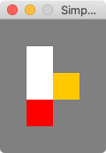
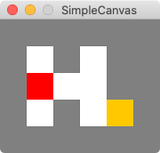

<script src="https://cdn.mathjax.org/mathjax/latest/MathJax.js?config=TeX-AMS-MML_HTMLorMML" type="text/javascript"></script>

# CS 142 Project 4: Corn-Free Maze
{: .no_toc }

1. TOC
{:toc}

Every year, Farmer Phil creates a corn maze for the local Memphians to navigate through.  This year, however, so many people apparently are allergic to corn that Farmer Phil decided to bulldoze his crop and create a maze in the open field with no walls at all!  Instead of using corn as obstacles, the way one solves the maze is each row and column in the maze has a number associated with it that specifies how many cells in that row or column must be filled in the maze solution.

For example, suppose you have this maze:

The green circle indicates the starting location, the red circle indicates the ending location, and the numbers along the sides indicate how many squares in that particular row or column must be filled as the person solves the maze.

Here is the solution:

Notice how the numbers along the sides of the maze match the number of cells filled in in that particular row or column.  Any other path between the green and red cells would have a different number of cells in some row or column, and so would not be a solution to this particular maze.

In this project, you will write a program to open a text file containing a description of a maze described above, use a recursive algorithm to discover the fastest way through the maze, and print out the solution at the end, along with some other statistics.

## Demo

<video controls>
  <source src="demo.mp4" type="video/mp4">>
Your browser does not support the video tag.
</video>

## Starter code

**Make sure you create the project in a place on your computer where you can find it! I suggest making a new subfolder in your CS 142 projects folder.**

You can download the starter code for this assignment by creating a new IntelliJ project from version control (VCS) and using the following URL:

```
https://github.com/pkirlin/cs142-f24-proj4
```

## Concepts in this program

### Maze text files

Each text file describing a maze is organized into lines, as follows:
- The first line contains the number of rows and number of columns in the maze.
- The second line contains the (row, col) of the starting point in the maze.
- The third line contains the (row, col) of the ending point in the maze.
- The fourth line contains a sequence of integers, one per row in the maze, specifying the number of cells that must contain part of the solution path for that row.
- The fifth line contains the same as the fourth line, but for columns.

Here is an example file (maze2.txt):

```
5 5  
0 0  
2 2  
5 1 4 2 5  
4 3 3 2 5
```

This file describes a 5-row, 5-column maze, matching this picture:

### Restrictions on the maze solution path

Because this maze has no walls, we must place certain restrictions on the solution path.
- The path can only go up, down, left, or right, not diagonally.
- The path can only use each square at most once (so the path can't cross itself, for instance).
- If a square is used as part of a path, no adjacent square may be used, not even a diagonal square.
  For instance the following path is illegal:
  ```
  * * * * 
  . . . *
  . . * *
  . . * * 
  ```
  because it is impossible to tell in the bottom right corner what the "true" path is,
  This is also illegal:
    ```
  . * * * 
  * * . *
  . . * *
  . . * . 
  ```

Because of the diagonal adjacency in the middle.

### Backtracking

We will explore two different recursive formulations of finding the shortest path through the maze, which we will refer to as *solving* the maze.  Both formulations, however, use a concept called *backtracking*, which is a common computational technique used in situations where we must construct a solution to a problem incrementally piece-by-piece.  Often during this process we will have a number of candidate pieces that *might* work in the solution, but we don't know ahead of time which ones will work and which ones won't.  So we try *all* of them one at a time.  If we encounter a situation where it is clear our current partial solution is not going to pan out, then we will **backtrack** to try a new solution.  

This technique is often used when people try to solve a jigsaw puzzle.  Imagine a large section of the puzzle that is already completed, and we try to fit new individual puzzle pieces into the whole puzzle.  If a piece doesn't fit, we remove it (backtrack) and try another piece in its place.  Eventually the entire puzzle is completed.

Backtracking can be used to solve many interesting problems, including puzzles like mazes, but also optimization problems that occur in the real world such as matching medical students to residency training programs, determining airline routes, scheduling work shifts, or deciding where to place a group of new stores in a city.  Backtracking is often used in a recursive fashion, because recursion automatically backtracks when it reaches the base case.  If you are interested, you can read more about backtracking on [Wikipedia](https://en.wikipedia.org/wiki/Backtracking). 

### Recursive formulations

We will develop two recursive formulations to solve a maze.  They both use the same idea, but return slightly different kinds of answers.  In our first formulation, we will simply determine *whether or not the maze can be solved*. In other words, this is a boolean (yes/no, true/false) question.  Is there a path from the start square to the ending square that follows the rules of the maze?

In the second formulation, we will determine the actual route that you can take from the starting location to the ending location (called a *path*).  The route will be a sequence of north/south/east/west directions, indicating the precise sequence of steps you must take in the maze. 

The recursive functions we will design around these formulations will be based on the current location of a person in the maze (a specific row and column).  As the person walks around, we will update the row/column counters appropriately: when the person takes a new step in the maze (adds a new square to the path), that will decrease two of the counters (one row and one column) by one.  Occasionally, the person will reach a square in the maze from which they can't take another step in any direction (this could be because they are blocked by the edges of the maze, or because they would need to decrease a counter by one).  In this situation, we will **backtrack** and **increase** the counters by one, to indicate we are "undo-ing" the previous step.

The **base case** in both formulations is when the person is located at the same place as the ending location **and** all the row/col counters are zero.  At this point, the maze is solved.

The **recursive case** in both formulations is similar.  The idea is that if the person is not located at the ending square, then there are *four* possible ways to continue solving the maze, each one involving a recursive call:

- Is there a solution to the maze from one step north from your current location?
- Is there a solution to the maze from one step south from your current location?
- Is there a solution to the maze from one step east from your current location?
- Is there a solution to the maze from one step west from your current location?

The idea is to make (up to) four recursive calls, from each of the four squares of the maze surrounding your current location.  Not all four of these calls will be "legal," in that one or more of the four squares might take you off the boundaries of the maze, might make a counter negative, or might create an "illegal" path.

**Formulation 1: Can the maze be solved?** In our first formulation, you must   simply determine *if* the maze can be solved.  Here, we don't care about the path taken from the starting position to the ending position.

To solve this problem, the person in the maze says, "Am I currently located in the ending square AND are all the row/col counters zero?" (the base case). If so, then we are done (success!). If the person is not located where the ending square is, the person will try to take one step north, and try to solve the maze recursively from that new location. If that didn't work, it will try to take one step south, and try to solve the maze recursively from that location. It will do the same thing for east and west. If one of those four recursive cases succeeds in solving the maze, then we are done (also success!). If none of the recursive cases solves the maze, then we are done (but with failure).

[ [See an example of how the recursive formulation works on a sample maze.](rec1) ]

**Formulation 2: What are the precise directions to solve the maze?**  The first formulation works, but the problem is is only returns success or failure, not the path taken through the maze.

To remedy this, let's change our recursive formulation to return strings rather than success or failure. Each string will represent the path through the maze from the starting location to the cup: we'll use "N", "S", "E", and "W" for the four cardinal directions, and "C" for the cup. If a path can't be found, we'll use "X" for failure.

[ [See an example of how the recursive formulation works on a sample maze.](rec2) ]

Your program will implement both recursive formulations.

### Marking squares

In the code, the maze is represented by a 2-dimensional char array.  This array initially begins as all periods (`'.'`).  We will "mark" squares in the array with asterisks/stars `'*'` when we arrive at a square, indicating it is part of the current path. When we are evaluating the surrounding directions to recurse on, we must make sure never to recurse on a square of the maze with a breadcrumb in it.  This will prevent us from walking in circles. 

An asterisk is placed in a square at the beginning of each recursive function. It is only removed if we need to backtrack, and therefore, when the algorithm finds the ending location, we can be guaranteed that there will be a single trail of asterisks from start to finish.  If your code determines that the recursion fails in all four possible directions, the marker turned back into a period `'..'` character.

### Determining if a step is legal

As mentioned above, when solving the maze, we must make sure never to construct an "illegal" path, meaning a path that contains two different sections that are adjacent to each other, even at a diagonal (see pictures above).  This is fairly simple to determine.  In the following discussion, we will use call squares with periods "open" and squares with asterisks "marked."

When you are considering adding a new square to a path, the new square must of course be open.  However, there are *five* additional squares that must be checked relative to the new square.  See the following diagram:

DIAGRAM

This picture shows a possible path from the green circle.  For this example, ignore the row/col counters.  Suppose we are considering adding the cell with the question mark to the end of the path.  We must verify that the five cells with X's are either **open** or **off the board**.  Those particular five cells are the adjacent and diagonally-adjacent cells to the question mark.

This works even when the path turns; see this diagram.

To help you implement this, the starter code has functions to fill in called `isOpen` and `isOpenOrOffBoard`.  Each of these functions takes a (row, col) coordinate:
-   `isOpen` should return true if the (row, col) is open on the board, and false in all other cases (including if the (row, col) is off the board).  
-   `isOpenOrOffBoard` should return true if the (row, col) is open on the board, or if the (row, col) is off the board).  

## Implementing the project

For this project, I will provide guidance in terms of a suggested order of writing different parts of the project, but you will have to make more design decisions about what functions and variables to use.  There may be times when you want to adjust the public/private-ness of methods, or add more parameters.  This is ok.

Begin by getting acquainted with the code.  Unlike the previous project, this one only uses two main classes  (plus SimpleCanvas).

- `Maze.java`: The `Maze` class is the heart of the project.  It represents the current state of the maze, and includes methods to load a maze from a text file, print the maze (in text form), draw the maze on a canvas, and solve the maze in two different ways.
- `RunMazeSolver.java`: This class is just a "driver" class for the Maze; it is equivalent to other classes we've looked at with "Demo" in their name. It solely exists to get the project started from a `main()` method, and also contains testing code that you will fill in.

Also take a look at the text files you are provided.  Each maze is solvable except `badmaze.txt`, which is purposefully unsolvable. 


### Step 1: Reading a maze from a text file

The first piece you will want to get working is reading the maze from a text file.  Read through Maze.java and make sure you understand the purpose of all the instance variables.

- There is a function called loadMaze() in Maze.java that takes a string --- the name of a text file --- as a parameter.  What I suggest doing is next is either modifying the constructor for Maze so it also takes a filename String parameter, and then inside the constructor, you can call loadMaze(), passing in that string as the name of the text file.  Or, you can forget the constructor, and turn loadMaze() into a public function, and call it yourself.  There are comments in the function to help you along, but the idea is you should read the text file and store its contents into whatever variables you created in Step 1.
  - **Stop and test.** Write the testFileReading() function in RunMazeSolver.  I suggest having the function create a new Maze object, then loading one of the sample text files (you can either keep changing the function to try multiple files, or you can make a Scanner to have the user type it in.  This is just testing code so it doesn't matter too much.)  Depending on how choices you made above, you may need to call loadMaze() yourself, or the constructor will call it for you.  Use print statements in your loadMaze() function to print out the file as it's being read, and make sure everything is working correctly.
- Write the printMaze() function in Maze next.  This function is mostly used for debugging, but like in the balloon program, it's important to be able to see the contents of the maze textually.
  - **Stop and test.**  Write some additional code in testFileReading() to print out the maze after it was read from the file using your printMaze() function.

### Step 2: Drawing the maze 

Next we will focus on the function in Maze called drawMaze().  

- The Maze constructor opens a SimpleCanvas, with width and height calculated off of the variables you read from the text file.  Depending on how you wrote loadMaze(), you might need to move the call to the SimpleCanvas constructor and the call to show() to the end of loadMaze() if the Maze constructor doesn't automatically call loadMaze().
  - Hint: There is a variable called SQUARESIZE in Maze.java that controls how big the squares are drawn. 
- Fill in the code for drawMaze().  Most is written for you, all you need to draw are the green and red circles and then the small circles (or other shape) to represent the path.  You won't be able to see a path though until later in the program.
  - **Stop and test.** Write the testDrawing() function in RunTournament.  This test function should read in a maze file and then call drawMaze() so it will be seen on the canvas.
- Note: If you cannot get the drawing code to work, you can still proceed to the following steps, using your printMaze() function instead of drawMaze().

###  Step 3: Get the boolean solver working

In this step, we will write the first recursive formulation of the problem, which determines *if* the maze can be solved.  This is done by implementing the functions canSolve() and canSolve(int currRow, int currCol).  The first of these is the public function that you will call from RunMazeSolver, but the work actually happens in the second, private function which takes the current position of the person in the maze as arguments.

Begin this section by writing isOpen and isOpenOrOffBoard.  Then, use these two functions to fill in canMoveNorth, canMoveWest, etc.  Each of the "canMoveXYZ" functions is designed to check the contents of the maze and the row/col counters to see if it is possible to move north from the (row, col) arguments given.  Hint: each of these "canMoveXYZ" functions should be checking if a certain cell is open, if five certain cells are open or off-board, and one row counter check, and one column counter check.

Then, write the no-argument canSolve().  All this function should do is call the two-argument canSolve(), passing in the starting row, col.  Follow the guidelines in the code.  
  - **Stop and test.**  Fill in testBooleanSolver() in RunMazeSolver.  Make a simple test function that loads a maze and calls canSolve() (which won't do much yet).  Have canSolve() print out the starting location.  Verify it is correct.
-   Then write the 2-argument version of canSolve.  This is the trickiest part of the assignment, because this is where the recursion happens.  Use *lots* of print statements and/or the debugger to get this to work.  You *must* print the location of the person at the beginning and ending of this function - the parts that say "arriving" and "backtracking."  These are critical to helping you debug.

See the video earlier for a demo; the demo uses the directional solver, but the video is almost the same.

- Once the boolean solver is working, we can start transitioning our program towards the final version.  At this point, you should write code in main() to make the program work more like the examples near the end of this webpage.  Specifically, your program should:
  - Ask the user for which maze file they want to read.
  - Ask the user for the amount of time they want to pause between movements on the canvas (you may want to add an additional instance variable in Maze, and either another method to Maze, or change the constructor so get this value into the Maze class somehow).
  - Ask the user if they want to run the boolean solver or the directional solver (you can skip this for now if you want, since the directional solver isn't written yet).
  - Run the solver.  You should print out the maze at the beginning and end in text.  You should also print out whenever the person enters a new square or backtracks (you should already have done this in canSolve()).  
    - One new part to add is you should keep track of the total number of calls to canSolve that are made, and print this out at the end.  You will need to add a new instance variable in Maze to keep track of this.
- **Stop and test**.  At this point you should test your maze solver against the examples in the section below.  Verify that the printing of the maze, printing arriving and backtracking, and the final number of calls matches mine.

###  Step 4: Get the directional solver working

In this step, we will write the second recursive formulation of the problem, which determines *how* the maze can be solved.  This is done by implementing the 2 versions of directionalSolve().  These two functions work similarly so the two canSolve functions.  The only major difference is that instead of returning a boolean, they return a string, consisting of directions from the starting location to the cup.  Each direction is a character: N (north), S (south), E (east), or W (west).

- Write these two functions, following the guidance in the code.  The only hard part is changing the code to work with string answers instead of boolean answers.

- **Stop and test**.  At this point you should test your maze solver against the examples in the section below.
  Verify that the printing of the maze, calls to the patronus entering and backtracking, and the final number of calls matches mine.

## Sample output

- maze0: [ [Boolean solver](maze0-bool.txt) ] [ [Directional solver](maze0-dir.txt) ]
- maze1: [ [Boolean solver](maze1-bool.txt) ] [ [Directional solver](maze1-dir.txt) ]
- maze2: [ [Boolean solver](maze2-bool.txt) ] [ [Directional solver](maze2-dir.txt) ]
- maze3: [ [Boolean solver](maze3-bool.txt) ] [ [Directional solver](maze3-dir.txt) ]
- badmaze: [ [Boolean solver](badmaze-bool.txt) ] [ [Directional solver](badmaze-dir.txt) ]


## Final reminders

Your code should:
- Prompt the user for a filename, pause time, and which solver to use.
- Display the maze textually, run the desired solver, and display the maze again afterwards.  The second text maze display should show the final path.
- As the solver is running, the graphical display should show the path as it being constructed (and backtracked upon).
- When done, your program should display the total number of calls to the solver, along with the final path directions and length of the path, if using
  the directional solver. 

## What to turn in

Through Canvas, turn in all your `.java` files.
Additionally, upload a text file answering the following questions:
- What bugs and conceptual difficulties did you encounter? How did you overcome them? What did you learn?

- Describe any serious problems you encountered while writing the program (larger things than the previous question).

- Describe whatever help (if any) that you received. Don’t include readings, lectures, and exercises, but do include any help from other sources,

such as websites or people (including classmates and friends) and attribute them by name.

- Did you do any of the challenges (see below)? If so, explain what you did.

- List any other feedback you have. Feel free to provide any feedback on how much you learned from doing the assignment, and whether you enjoyed

doing it.

## Reminders

- Do not forget to comment your code and put a comment at the top with your name and the pledge.

## Challenges

- You may notice, especially on the larger mazes, that there are some paths that will be explored that you can see (as a person) that will eventually cause backtracking, even if the computer doesn't immediately realize it.  In other words, the recursive maze solver is rather inefficient, and has a human, you would probably be able to not have it explore as many of the "inefficient" paths.  Change your program so it is more efficient (doesn't explore as many paths that will need to be backtracked).  Make a copy of Maze.java before you do so, and turn that in along with the original Maze.java (where the output will match mine).


In *Harry Potter and the Goblet of Fire*, Harry and three other students participate in the Triwizard Tournament, which culminates in having to navigate a large maze, searching for the Triwizard Cup hidden inside.  Harry knows that there are many dangers hidden in the maze, so he would like to find the quickest route from his starting location to wherever the cup is hidden, to minimize the amount of time he actually spends inside the maze. To help him, he decides to send his patronus* into the maze ahead of him, while he waits at the start of the maze.  The patronus will explore the maze and through a process called *backtracking*, discover the shortest path from Harry's location to the cup.

**In the Harry Potter series, a patronus is a spirit or apparition that a witch or wizard can cast.  You don't have to know anything specific about them, or other facts about Harry Potter, other than the patronus is the character that is moving around the maze and determining the shortest path in this project.*

In this project, you will write a program to open a text file containing a description of a maze, use a recursive algorithm to discover the fastest way through the maze to the Triwizard Cup, and print out the solution at the end, along with some other statistics.

## Demo

<video controls>
  <source src="maze4-tall.mp4" type="video/mp4">>
Your browser does not support the video tag.
</video>

## Starter code

**Make sure you create the project in a place on your computer where you can find it! I suggest making a new subfolder in your CS 142 projects folder.**

You can download the starter code for this assignment by creating a new IntelliJ project from version control (VCS) and using the following URL:

```
https://github.com/pkirlin/cs142-f22-proj4
```

## Concepts in this program

### Maze text files

Each text file describing a maze is organized into lines.  The first line of each file always contains two integers: the number of rows in the maze and the number of columns.  Each of the following lines will contain a single string, representing a single row of the maze.

Here is an example file (maze0.txt):

```
5 4
####
# ##
# C#
#H##
####
```

This file describes a 5-row, 4-column maze, though a maze may have any number of rows and any number of columns. The hash marks (`#`) specify hedges in the maze that the patronus cannot go through; it is guaranteed that there will always be a complete hedge border on the outer boundary of the maze file (so the patronus cannot leave the boundaries of the maze). Harry's starting position in the maze is specified by the letter `H`, and the Triwizard Cup that Harry (and the patronus) is seeking is marked by the letter `C`. Blank spaces specify open sections of the maze where the patronus is allowed to move as it searches for the cup.

### Backtracking

We will explore two different recursive formulations of finding the shortest path through the maze, which we will refer to as *solving* the maze.  Both formulations, however, use a concept called *backtracking*, which is a common computational technique used in situations where we must construct a solution to a problem incrementally piece-by-piece.  Often during this process we will have a number of candidate pieces that *might* work in the solution, but we don't know ahead of time which ones will work and which ones won't.  So we try *all* of them one at a time.  If we encounter a situation where it is clear our current partial solution is not going to pan out, then we will **backtrack** to try a new solution.  

This technique is often used when people try to solve a jigsaw puzzle.  Imagine a large section of the puzzle that is already completed, and we try to fit new individual puzzle pieces into the whole puzzle.  If a piece doesn't fit, we remove it (backtrack) and try another piece in its place.  Eventually the entire puzzle is completed.

Backtracking can be used to solve many interesting problems, including puzzles like mazes, but also optimization problems that occur in the real world such as matching medical students to residency training programs, determining airline routes, scheduling work shifts, or deciding where to place a group of new stores in a city.  Backtracking is often used in a recursive fashion, because recursion automatically backtracks when it reaches the base case.  If you are interested, you can read more about backtracking on [Wikipedia](https://en.wikipedia.org/wiki/Backtracking). 

### Recursive formulations

We will develop two recursive formulations to solve a maze.  They both use the same idea, but return slightly different kinds of answers.  In our first formulation, we will simply determine *whether or not the maze can be solved*. In other words, this is a boolean (yes/no, true/false) question.  Is there a path from Harry to the cup at all?

In the second formulation, we will determine the actual route that Harry can take from his starting location to the cup (sometimes called a *path*).  The route will be a sequence of north/south/east/west directions, indicating the precise sequence of steps Harry must take in the maze. 

The recursive functions we will design around these formulations will be based on the current location of the patronus in the maze (a specific row and column).

The **base case** in both formulations is when the patronus is located at the same place as the cup.  At this point, the cup is found, so we know there is *a* way for Harry to get from his starting location to the cup.  

The **recursive case** in both formulations is similar.  The idea is that if the patronus is *not* located exactly where the cup is, then there are *four* possible ways to continue solving the maze, each one involving a recursive call:

- Is there a solution to the maze from one step north from the patronus's current location?
- Is there a solution to the maze from one step south from the patronus's current location?
- Is there a solution to the maze from one step east from the patronus's current location?
- Is there a solution to the maze from one step west from the patronus's current location?

The idea is to make (up to) four recursive calls, from each of the four squares of the maze surrounding the patronus's current location.  Not all four of these calls will be "legal," in that one or more of the four squares might be blocked by hedges, 

**Formulation 1: Can the maze be solved?** In our first formulation, the patronus must simply determine *if* the maze can be solved.  Here, we don't care about the path taken from the starting position to the cup's position.

To solve this problem, the patronus says, "Am I currently located where the cup is located?" (the base case). If so, then we are done (success!). If the patronus is not located where the cup is, it will try to take one step north, and try to solve the maze recursively from that new location. If that didn't work, it will try to take one step south, and try to solve the maze recursively from that location. It will do the same thing for east and west. If one of those four recursive cases succeeds in solving the maze, then we is done (also success!). If none of the recursive cases solves the maze, then we is done (but with failure).

[ [See an example of how the recursive formulation works on a sample maze.](rec1) ]

**Formulation 2: What are the precise steps to solve the maze?**  The first formulation works, but the problem is is only returns success or failure, not the path taken through the maze.

To remedy this, let's change our recursive formulation to return strings rather than success or failure. Each string will represent the path through the maze from the starting location to the cup: we'll use "N", "S", "E", and "W" for the four cardinal directions, and "C" for the cup. If a path can't be found, we'll use "X" for failure.

[ [See an example of how the recursive formulation works on a sample maze.](rec2) ]

Your program will implement both recursive formulations.

### Breadcrumbs

We will use "breadcrumbs" for [marking what squares in the maze the patronus has already visited](http://en.wikipedia.org/wiki/Hansel_and_gretel).  The patronus, when moving onto a square of the maze, will drop a (virtual) breadcrumb, marking that square as visited.  When the patronus is evaluating its surrounding directions to recurse on, it must make sure never to recurse on a square of the maze with a breadcrumb in it.  This will prevent it from walking in circles. 

A breadcrumb is placed in a square at the beginning of each recursive function. It is only removed if we reach a dead end, and therefore, when the algorithm finds the cup, we can be guaranteed that there will be a single trail of breadcrumbs from start to finish. In your code, you will represent breadcrumbs by a period character  `'.'`. When the code asks you to drop a breadcrumb, you will literally alter the current character in the maze from a blank space to a lowercase period. If the patronus determines that the recursion fails in all four possible directions, the breadcrumb will be picked back up (turned back into a blank character).

### Drawing the maze

The maze will be drawn in a similar fashion to previous projects that used grids (gumdrop gatherer, tic-tac-toe, car racing), in that each square of the maze will be drawn as a square on the board with various features.  The exact drawing specifications are up to you, but here are the requirements:

- Pick different colors for the hedges, the open squares of the maze, the location of the cup, and Harry/the patronus's starting location.  I used (gray, white, orange, and red for these, respectively).
- The patronus and breadcrumbs can be drawn either as squares or as dots on squares.  I think dots look nicer, but pick whichever you like more.  

## Implementing the project

For this project, I will provide guidance in terms of a suggested order of writing different parts of the project, but you will have to make more design decisions about what functions and variables to use.  There may be times when you want to adjust the public/private-ness of methods, or add more parameters.  This is ok.

Begin by getting acquainted with the code.  Unlike the previous project, this one only uses two main classes  (plus SimpleCanvas).

- `Maze.java`: The `Maze` class is the heart of the project.  It represents the current state of the maze, and includes methods to load a maze from a text file, print the maze (in text form), draw the maze on a canvas, and solve the maze in two different ways.
- `RunTournament.java`: This class is just a "driver" class for the Maze; it is equivalent to other classes we've looked at with "Demo" in their name. It solely exists to get the project started from a `main()` method, and also contains testing code that you will fill in.

Also take a look at the text files you are provided.  Notice how each file begins with a line with the dimensions of the maze (rows & columns), followed by the contents of the maze itself.  Remember: `#` is a wall (hedge) of the maze, a space is an open square in the maze, `H` is where Harry begins, and `C` is the location of the cup (the end of the maze).  Each maze is solvable except `maze3-broken.txt`, which is purposefully unsolvable. 

### Step 1: Decide on instance variables for your maze

Before you can start writing code, you must decide how to store what the maze looks like.  This can be done in various ways, such as with a 2-d array of `char`s, or an array or ArrayList of Strings, or even an ArrayList of ArrayList of `Character`s (2-d ArrayList).  Add appropriate instance variables to the `Maze` class to store the contents of the maze itself (what you read from the textfile).  You will probably want to add variables to store the dimensions of the maze as well.

Note: I think the easiest option is `char[][]` for the data type of the maze, because then you can use the gumdrop program as a model for many of the 
algorithms you will write here.  Using `char[][]` makes the file-reading code a little trickier, but I think makes the remainder of the program more
straightforward.  Using an `ArrayList<String>` makes it easier to write the file-reading code, but then accessing characters within the maze requires two method calls
(one to `get()` and one to `charAt()`.  Furthermore, when you must *modify* the maze to drop breadcrumbs, this requires replacing the entire row of the maze, since
in Java you can't modify individual characters within strings.)

### Step 2: Reading a maze from a text file

The first piece you will want to get working is reading the maze from a text file.  

- There is a function called loadMaze() in Maze.java that takes a string --- the name of a text file --- as a parameter.  What I suggest doing is next is either modifying the constructor for Maze so it also takes a filename String parameter, and then inside the constructor, you can call loadMaze(), passing in that string as the name of the text file.  Or, you can forget the constructor, and turn loadMaze() into a public function, and call it yourself.  There are comments in the function to help you along, but the idea is you should read the text file and store its contents into whatever variables you created in Step 1.
  - **Stop and test.** Write the testFileReading() function in RunTournament.  I suggest having the function create a new Maze object, then loading one of the sample text files (you can either keep changing the function to try multiple files, or you can make a Scanner to have the user type it in.  This is just testing code so it doesn't matter too much.)  Depending on how choices you made above, you may need to call loadMaze() yourself, or the constructor will call it for you.  Use print statements in your loadMaze() function to print out the file as it's being read, and make sure everything is working correctly.
- Write the printMaze() function in Maze next.  This function is mostly used for debugging, but like in the gumdrop program, it's important to be able to see the contents of the maze textually.
  - **Stop and test.**  Write some additional code in testFileReading() to print out the maze after it was read from the file using your printMaze() function.

### Step 3: Drawing the maze with and without the patronus

Next we will focus on the two functions in Maze called drawMaze() and drawMazeWithPatronus().  They do the same basic task --- draw the maze --- but because the patronus is not represented in the maze itself (it is not a character like H or C), it needs the separate parameters that drawMazeWithPatronus() has.

- The Maze constructor opens a SimpleCanvas, but its width and height are initially zero.  Modify these dimensions to make the width and height of the canvas be based on the size of the maze you read in.  Depending on how you wrote loadMaze(), you might need to move the call to the SimpleCanvas constructor and the call to show() to the end of loadMaze() if the Maze constructor doesn't automatically call loadMaze().
  - Hint: Like in tic-tac-toe and the gumdrop program, you will need to choose how big the squares are drawn on the canvas.  I suggest 30-by-30.
- Fill in the code for drawMaze().  I suggest using your gumdrop program and/or tic-tac-toe as a guide, because the concepts are identical.  Follow the guidelines above for drawing hedges, open squares, the cup, and Harry's starting position.
  - **Stop and test.** Write the testDrawing() function in RunTournament.  This test function should read in a maze file and then call drawMaze() so it will be seen on the canvas.
  - Examples: 
    maze0.txt   
    maze1.txt   
    maze2.txt   
- Fill in the code for drawMazeWithPatronus().  This function will be very short, because all you need to do is call your drawMaze() function and then draw a dot for where the patronus is.
  - **Stop and test.** Write the testDrawingPatronus() function in RunTournament.  This test function should read in a maze file and then call drawMazeWithPatronus() so it will be seen on the canvas.  Note that the maze doesn't specify where the patronus is, so you should make up some test coordinates for where it is.
  - Example:
    maze1.txt with patronus at row 1, col 2: 
- Note: If you cannot get the drawing code to work, you can still proceed to the following steps, using your printMaze() function instead of drawMaze().

###  Step 4: Get the boolean solver working

In this step, we will write the first recursive formulation of the problem, which determines *if* the maze can be solved.  This is done by implementing the functions canSolve() and canSolve(int patronusRow, int patronusCol).  The first of these is the public function that you will call from RunTournament, but the work actually happens in the second, private function which takes the position of the patronus as arguments.

- Write the no-argument canSolve() first.  Follow the guidelines in the code.  Don't worry about the second canSolve() function yet.
  - **Stop and test.** This is to verify that you've found Harry's location (the initial location for the patronus correctly).  Fill in testBooleanSolver() in RunTournament.  Make a simple test function that loads a maze and calls canSolve() (which won't do much yet).  Have canSolve() print out Harry's location.  Verify it is correct.
- Now have canSolve() call canSolve(int patronusRow, int patronusCol), passing in Harry's location, because that's where the patronus begins.  Then write the 2-argument version of canSolve.  This is the trickiest part of the assignment, because this is where the recursion happens.  Use *lots* of print statements and/or the debugger to get this to work.  You *must* print the location of the patronus at the beginning and ending of this function.
- You may need to go back to your drawing code to get the breadcrumbs to show up.

- Sample run through for the boolean solver:

  <video controls>
  <source src="boolean-solver.mp4" type="video/mp4">
  Your browser does not support the video tag.
  </video>

- Once the boolean solver is working, we can start transitioning our program towards the final version.  At this point, you should write code in main() to make the program work more like the examples near the end of this webpage.  Specifically, your program should:
  - Ask the user for which maze file they want to read.
  - Ask the user for the amount of time they want to pause between movements on the canvas (you may want to add an additional instance variable in Maze, and either another method to Maze, or change the constructor so get this value into the Maze class somehow).
  - Ask the user if they want to run the boolean solver or the directional solver (you can skip this for now if you want, since the directional solver isn't written yet).
  - Run the solver.  You should print out the maze at the beginning and end in text.  You should also print out whenever the patronus enters a new square or backtracks (you should already have done this in canSolve()).  
    - One new part to add is you should keep track of the total number of calls to canSolve that are made, and print this out at the end.  You will need to add a new instance variable in Maze to keep track of this.
- **Stop and test**.  At this point you should test your maze solver against the examples in the section below.  Verify that the printing of the maze, calls to the patronus entering and backtracking, and the final number of calls matches mine.

###  Step 5: Get the directional solver working

In this step, we will write the second recursive formulation of the problem, which determines *how* the maze can be solved.  This is done by implementing the functions directionalSolve() and directionalSolve(int patronusRow, int patronusCol).  These two functions work similarly so the two canSolve functions.  The only major difference is that instead of returning a boolean, they return a string, consisting of directions from the starting location to the cup.  Each direction is a character: N (north), S (south), E (east), or W (west).

- Write these two functions, following the guidance in the code.  The only hard part is changing the code to work with string answers instead of boolean answers.

- Sample run through for the directional solver:

  <video controls>
  <source src="directional-solver.mp4" type="video/mp4">
  Your browser does not support the video tag.
  </video>

- **Stop and test**.  At this point you should test your maze solver against the examples in the section below.
  Verify that the printing of the maze, calls to the patronus entering and backtracking, and the final number of calls matches mine.

## Sample output

- maze0: [ [Boolean solver](maze0-out1.txt) ] [ [Directional solver](maze0-out2.txt) ]
- maze1: [ [Boolean solver](maze1-out1.txt) ] [ [Directional solver](maze1-out2.txt) ]
- maze2: [ [Boolean solver](maze2-out1.txt) ] [ [Directional solver](maze2-out2.txt) ]
- maze3: [ [Boolean solver](maze3-out1.txt) ] [ [Directional solver](maze3-out2.txt) ]
- maze3-broken: [ [Boolean solver](maze3-broken-out1.txt) ] [ [Directional solver](maze3-broken-out2.txt) ]
- maze4: [ [Boolean solver](maze4-out1.txt) ] [ [Directional solver](maze4-out2.txt) ]
- maze5: [ [Boolean solver](maze5-out1.txt) ] [ [Directional solver](maze5-out2.txt) ] 

## Final reminders

Your code should:
- Prompt the user for a filename, pause time, and which solver to use.
- Display the maze textually, run the desired solver, and display the maze again afterwards.  The second text maze display should show the final breadcrumbs path.
- As the solver is running, the graphical display should show the breadcrumbs and the patronus as the maze is being explored.
- When done, your program should display the total number of calls to the solver, along with the final path directions and length of the path, if using
  the directional solver. Meanwhile, in text, it should show the progress of the patronus and the backtracking.

## What to turn in

Through Canvas, turn in all your `.java` files.
Additionally, upload a text file answering the following questions:

1. What bugs and conceptual difficulties did you encounter? How did you overcome them? What did you learn?
2. Describe whatever help (if any) that you received. Don’t include readings, lectures, and exercises, but do include any help from other sources, such as websites or people (including classmates and friends) and attribute them by name.
3. Describe any serious problems you encountered while writing the program.
4. Did you do any of the challenges (see below)? If so, explain what you did.
5. List any other feedback you have. Feel free to provide any feedback on how much you learned from doing the assignment, and whether you enjoyed doing it.

## Reminders

- Do not forget to comment your code.

## Challenges

- You may notice that all of the sample mazes provided have exactly one solution.  That is, there is one path from where Harry starts to the cup.  Therefore, your recursive code doesn't need to handle the situation where it may have to decide which of two possible paths is better/faster/quicker/shorter.  Develop a version of your code that will work with mazes with multiple solutions, and find the shortest one.  To do this, try copying one of the larger maze files and deleting a few walls.  This will open up multiple paths to the solution.

